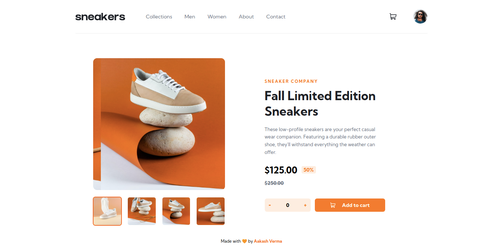

# Frontend Mentor - E-commerce product page solution

## Table of contents

- [Overview](#overview)
  - [The challenge](#the-challenge)
  - [Screenshot](#screenshot)
  - [Links](#links)
- [My process](#my-process)
  - [Built with](#built-with)
  - [What I learned](#what-i-learned)
  - [Continued development](#continued-development)

**Note: Delete this note and update the table of contents based on what sections you keep.**

## Overview

### The challenge

Users should be able to:

- View the optimal layout for the site depending on their device's screen size
- See hover states for all interactive elements on the page
- Open a lightbox gallery by clicking on the large product image
- Switch the large product image by clicking on the small thumbnail images
- Add items to the cart
- View the cart and remove items from it

### Screenshot

### Links

- Solution URL: [GitHub](https://github.com/skyv26/sneakers)
- Live Site URL: [Netlify](https://sneekers.netlify.app/)

## My process

### Built with

- Semantic HTML5 markup
- CSS custom properties
- Flexbox
- CSS Grid
- Mobile-first workflow
- [React](https://reactjs.org/) - JS library
- [Styled Components](https://styled-components.com/) - For styles

**Note: These are just examples. Delete this note and replace the list above with your own choices**

### What I learned

I learnt React Hooks with great learning experience while making this project and also I did work a lot on CSS too..

### Continued development

ReactJS, Redux, Backend Development using Python Django

## Author

- Website - [Aakash Verma](https://www.your-site.com)
- Frontend Mentor - [@skyv26](https://www.frontendmentor.io/profile/skyv26)
- Github - [Aakash Verma](https://www.github.com/skyv26)

